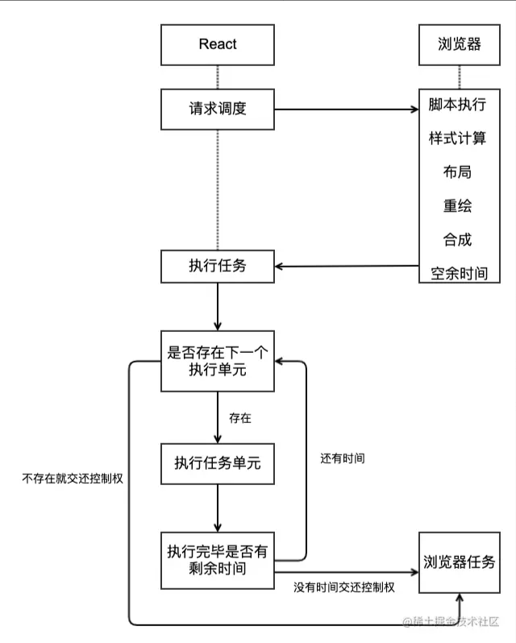
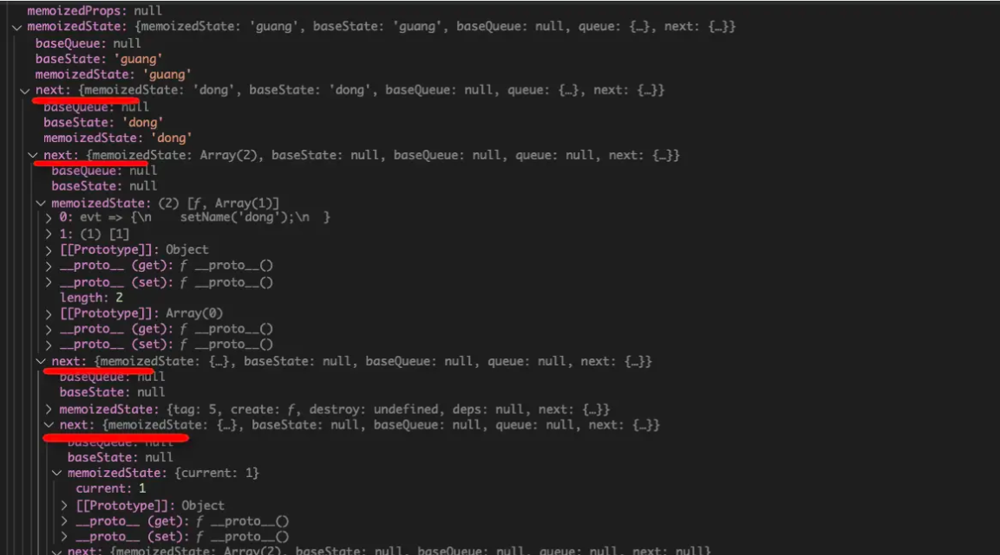
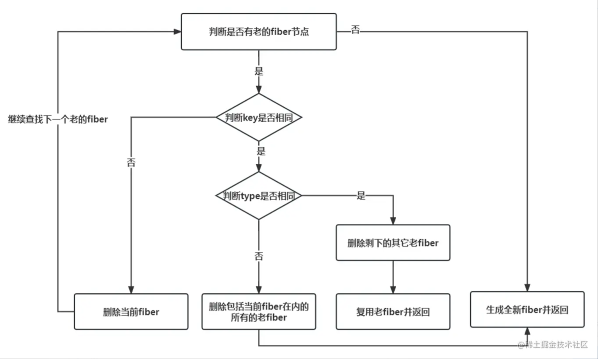
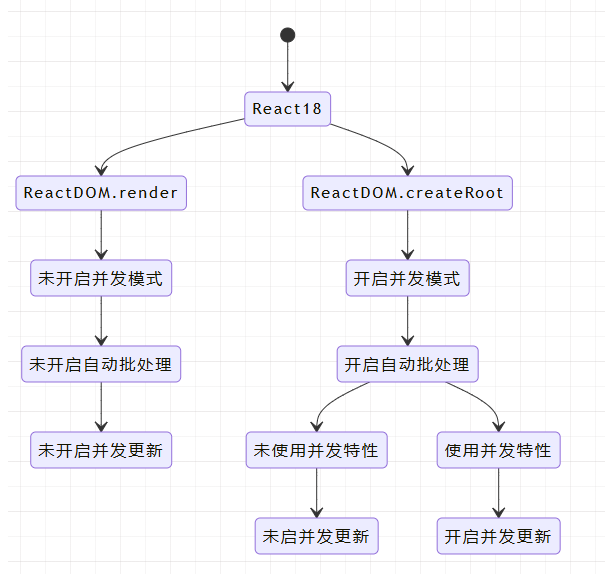
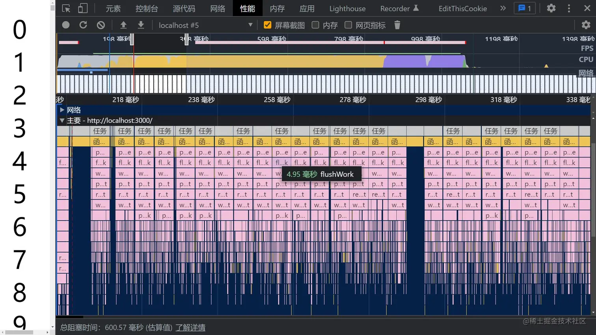

### Fiber的结构
```ts
function FiberNode(
  this: $FlowFixMe,
  tag: WorkTag,
  pendingProps: mixed,
  key: null | string,
  mode: TypeOfMode,
) {
  // 基本属性
  this.tag = tag; // 描述此Fiber的启动模式的值（LegacyRoot = 0; ConcurrentRoot = 1）
  this.key = key; // React key
  this.elementType = null; // 描述React元素的类型。例如，对于JSX<App />，elementType是App
  this.type = null; // 组件类型
  this.stateNode = null; // 对于类组件，这是类的实例；对于DOM元素，它是对应的DOM节点。

  // Fiber链接
  this.return = null; // 指向父Fiber
  this.child = null; // 指向第一个子Fiber
  this.sibling = null; // 指向其兄弟Fiber
  this.index = 0; // 子Fiber中的索引位置

  this.ref = null; // 如果组件上有ref属性，则该属性指向它
  this.refCleanup = null; // 如果组件上的ref属性在更新中被删除或更改，此字段会用于追踪需要清理的旧ref

  // Props & State
  this.pendingProps = pendingProps; // 正在等待处理的新props
  this.memoizedProps = null; // 上一次渲染时的props
  this.updateQueue = null; // 一个队列，包含了该Fiber上的状态更新和副作用
  this.memoizedState = null; // 上一次渲染时的state
  this.dependencies = null; // 该Fiber订阅的上下文或其他资源的描述

  // 工作模式
  this.mode = mode; // 描述Fiber工作模式的标志（例如Concurrent模式、Blocking模式等）。

  // Effects
  this.flags = NoFlags; // 描述该Fiber发生的副作用的标志（十六进制的标识）
  this.subtreeFlags = NoFlags; // 描述该Fiber子树中发生的副作用的标志（十六进制的标识）
  this.deletions = null; // 在commit阶段要删除的子Fiber数组

  this.lanes = NoLanes; // 与React的并发模式有关的调度概念。
  this.childLanes = NoLanes; // 与React的并发模式有关的调度概念。

  this.alternate = null; // Current Tree和Work-in-progress (WIP) Tree的互相指向对方tree里的对应单元

  // 如果启用了性能分析
  if (enableProfilerTimer) {
    // ……
  }

  // 开发模式中
  if (__DEV__) {
    // ……
  }
}
```

### React Fiber 原理【最核心的点就是：可以中断和恢复】

1. **单元工作**: Fiber 是 React 的一个执行单元，在 React 16 之后，React 将整个渲染任务拆分成了一个个的小任务进行处理，每一个小任务指的就是 Fiber 节点的构建。 拆分的小任务会在浏览器的空闲时间被执行(`requestIdleCallback`)
2. **链接属性**：child、sibling 和 return 字段构成了Fiber之间的链接关系，使React能够遍历组件树并知道从哪里开始、继续或停止工作。
3. **双缓冲技术**： React在更新时，会根据现有的Fiber树（Current Tree）创建一个新的临时树（Work-in-progress (WIP) Tree），WIP-Tree包含了当前更新受影响的最高节点直至其所有子孙节点。Current Tree是当前显示在页面上的视图，WIP-Tree则是在后台进行更新，WIP-Tree更新完成后会复制其它节点，并最终替换掉Current Tree，成为新的Current Tree。因为React在更新时总是维护了两个Fiber树，所以可以随时进行比较、中断或恢复等操作，而且这种机制让React能够同时具备拥有优秀的渲染性能和UI的稳定性。
4. **State 和 Props**：memoizedProps、pendingProps 和 memoizedState 字段让React知道组件的上一个状态和即将应用的状态。通过比较这些值，React可以决定组件是否需要更新，从而避免不必要的渲染，提高性能。
5. **副作用的追踪**：flags 和 subtreeFlags 字段标识Fiber及其子树中需要执行的副作用，例如DOM更新、生命周期方法调用等。React会积累这些副作用，然后在Commit阶段一次性执行，从而提高效率。

### Fiber工作流程
#### 第一阶段：`Reconciliation`（调和）
##### 创建与标记更新节点：`beginWork`
  ```ts
  // 判断Fiber节点是否要更新：
  // packages/react-reconciler/src/ReactFiberBeginWork.js
  // 以下只是核心逻辑的代码，不是beginWork的完整源码
  function beginWork(
    current: Fiber | null,
    workInProgress: Fiber,
    renderLanes: Lanes,
  ): Fiber | null {
      if (current !== null) {
          // 这是旧节点，需要检查props和context是否有变化再确认是否需要更新节点
          const oldProps = current.memoizedProps;
          const newProps = workInProgress.pendingProps;

          if(oldProps !== newProps || hasLegacyContextChanged()) {
              didReceiveUpdate = true; // props和context有变化，说明节点有更新
          } else {
              // 其它特殊情况的判断
          }
      } else {
          didReceiveUpdate = false; // 这是新节点，要创建，而不是更新
      }

      workInProgress.lanes = NoLanes; // 进入beginWork表示开始新的工作阶段，所以要把旧的workInProgress优先级清除掉

      switch (workInProgress.tag) {
          // 通过workInProgress的tag属性来确定如何处理当前的Fiber节点
          // 每一种tag对应一种不同的Fiber类型，进入不同的调和过程（reconcileChildren()）
          case IndeterminateComponent: // 尚未确定其类型的组件
          // ……
          case LazyComponent: // 懒加载组件
          // ……
          case FunctionComponent: // 函数组件
          // ……
          case ClassComponent: // 类组件
          // ……
          // 其它多种Fiber类型
      }
  }
  ```
  ```ts
  // 判断Fiber子节点是更新还是复用：
  export function reconcileChildren(
    current: Fiber | null,
    workInProgress: Fiber,
    nextChildren: any, // 要调和的新的子元素
    renderLanes: Lanes,
  ) {
    if (current === null) {
      // 如果current为空，说明这个Fiber是首次渲染，React会为nextChildren生成一组新的Fiber节点
      workInProgress.child = mountChildFibers(
        workInProgress,
        null,
        nextChildren,
        renderLanes,
      );
    } else {
      // 当current非空时，React会利用现有的Fiber节点（current.child）和新的子元素（nextChildren）进行调和
      workInProgress.child = reconcileChildFibers(
        workInProgress,
        current.child,
        nextChildren,
        renderLanes,
      );
    }
  }
  ```
`mountChildFibers`和`reconcileChildFibers`最终会进入同一个方法`createChildReconciler`，执行 Fiber 节点的调和（处理诸如新的 Fiber 创建、旧 Fiber 删除或现有 Fiber 更新等操作）。而整个 `beginWork` 完成后，就会进入 `completeWork` 流程。

##### 收集副作用列表：`completeUnitOfWork`和`completeWork`
`completeUnitOfWork` 负责遍历Fiber节点，同时记录了有副作用节点的关系。下面从源码上理解它的工作：
  ```ts
  // packages/react-reconciler/src/ReactFiberWorkLoop.js
  // 以下只是核心逻辑的代码，不是completeUnitOfWork的完整源码
  function completeUnitOfWork(unitOfWork: Fiber): void {
      let completedWork: Fiber = unitOfWork; // 当前正在完成的工作单元
      do {
          const current = completedWork.alternate; // 当前Fiber节点在另一棵树上的版本
          const returnFiber = completedWork.return; // 当前Fiber节点的父节点

          let next;
          next = completeWork(current, completedWork, renderLanes); // 调用completeWork函数

          if (next !== null) {
            // 当前Fiber还有工作要完成
            workInProgress = next;
            return;
          }
          const siblingFiber = completedWork.sibling;
          if (siblingFiber !== null) {
            // 如果有兄弟节点，则进入兄弟节点的工作
            workInProgress = siblingFiber;
            return;
          }
          // 如果没有兄弟节点，回到父节点继续
          completedWork = returnFiber;
          workInProgress = completedWork;
      } while (completedWork !== null);

      // 如果处理了整个Fiber树，更新workInProgressRootExitStatus为RootCompleted，表示调和已完成
    if (workInProgressRootExitStatus === RootInProgress) {
      workInProgressRootExitStatus = RootCompleted;
    } 
  }
  ```
`completeWork` 在 `completeUnitOfWork` 中被调用，下面是 `completeWork` 的逻辑，主要是根据 tag 进行不同的处理，真正的核心逻辑在 `bubbleProperties` 里面
  ```ts
  // packages/react-reconciler/src/ReactFiberCompleteWork.js
  // 以下只是核心逻辑的代码，不是completeWork的完整源码
  function completeWork(
    current: Fiber | null,
    workInProgress: Fiber,
    renderLanes: Lanes,
  ): Fiber | null {
    const newProps = workInProgress.pendingProps;
      switch (workInProgress.tag) {
      // 多种tag
      case FunctionComponent:
      case ForwardRef:
      case SimpleMemoComponent:
          bubbleProperties(workInProgress)
          return null;
      case ClassComponent:
          // ……
          bubbleProperties(workInProgress)
          return null;
      case HostComponent:
          // ……
          return null;
      // 多种tag
          // ……
    }
  }
  ```
bubbleProperties 为 completeWork 完成了两个工作：
1. 记录Fiber的副作用标志
2. 为子Fiber创建链表
  ```ts
  // packages/react-reconciler/src/ReactFiberCompleteWork.js
  // 以下只是核心逻辑的代码，不是bubbleProperties的完整源码
  function bubbleProperties(completedWork: Fiber) {
      const didBailout =
      completedWork.alternate !== null &&
      completedWork.alternate.child === completedWork.child; // 当前的Fiber与其alternate（备用/上一次的Fiber）有相同的子节点，则跳过更新

      let newChildLanes = NoLanes; // 合并后的子Fiber的lanes
      let subtreeFlags = NoFlags; // 子树的flags。

      if (!didBailout) {
          // 没有bailout，需要冒泡子Fiber的属性到父Fiber
          let child = completedWork.child;
          // 遍历子Fiber，并合并它们的lanes和flags
          while (child !== null) {
            newChildLanes = mergeLanes(
              newChildLanes,
              mergeLanes(child.lanes, child.childLanes),
            );

            subtreeFlags |= child.subtreeFlags;
            subtreeFlags |= child.flags;

            child.return = completedWork; // Fiber的return指向父Fiber，确保整个Fiber树的一致性
            child = child.sibling;
          }
          completedWork.subtreeFlags |= subtreeFlags; // 合并所有flags（副作用）
      } else {
          // 有bailout，只冒泡那些具有“静态”生命周期的flags
          let child = completedWork.child;
          while (child !== null) {
            newChildLanes = mergeLanes(
              newChildLanes,
              mergeLanes(child.lanes, child.childLanes),
            );

            subtreeFlags |= child.subtreeFlags & StaticMask; // 不同
            subtreeFlags |= child.flags & StaticMask; // 不同

            child.return = completedWork;
            child = child.sibling;
          }
          completedWork.subtreeFlags |= subtreeFlags;
      }
      completedWork.childLanes = newChildLanes; // 获取所有子Fiber的lanes。
      return didBailout;
  }
  ```

#### 第二阶段：Commit（提交）
* **目标**: 更新DOM并执行任何副作用。
* **原理**: 遍历在Reconciliation阶段创建的副作用列表进行更新。
##### 1. 遍历副作用列表：BeforeMutation
  ```ts
  // packages/react-reconciler/src/ReactFiberCommitWork.js
  // 以下只是核心逻辑的代码，不是commitBeforeMutationEffects的完整源码
  export function commitBeforeMutationEffects(
    root: FiberRoot,
    firstChild: Fiber,
  ): boolean {
    nextEffect = firstChild; // nextEffect是遍历此链表时的当前fiber
    commitBeforeMutationEffects_begin(); // 遍历fiber，处理节点删除和确认节点在before mutation阶段是否有要处理的副作用

    const shouldFire = shouldFireAfterActiveInstanceBlur; // 当一个焦点元素被删除或隐藏时，它会被设置为 true
    shouldFireAfterActiveInstanceBlur = false;
    focusedInstanceHandle = null;

    return shouldFire;
  }
  ```
##### 2. 正式提交：CommitMutation
  ```ts
  export function commitMutationEffects(
    root: FiberRoot,
    finishedWork: Fiber,
    committedLanes: Lanes,
  ) {
      // lanes和root被设置为"in progress"状态，表示它们正在被处理
    inProgressLanes = committedLanes;
    inProgressRoot = root;

      // 递归遍历Fiber，更新副作用节点
    commitMutationEffectsOnFiber(finishedWork, root, committedLanes);

      // 重置进行中的lanes和root
    inProgressLanes = null;
    inProgressRoot = null;
  }
  ```
##### 3. 处理layout effects：commitLayout
  ```ts
  export function commitLayoutEffects(
    finishedWork: Fiber,
    root: FiberRoot,
    committedLanes: Lanes,
  ): void {
    inProgressLanes = committedLanes;
    inProgressRoot = root;

    // 创建一个current指向就Fiber树的alternate
    const current = finishedWork.alternate;
    // 处理那些由useLayoutEffect创建的layout effects
    commitLayoutEffectOnFiber(root, current, finishedWork, committedLanes);

    inProgressLanes = null;
    inProgressRoot = null;
  }
  ```
一旦进入提交阶段后，React是无法中断的。


### React hook原理

  1. hooks 的实现就是基于 fiber 的，会在 fiber 节点上放一个链表，每个节点的 memorizedState 属性上存放了对应的数据，然后不同的 hooks api 使用对应的数据来完成不同的功能。
  2. useRef、useCallback、useMemo，它们只是对值做了缓存，逻辑比较纯粹
  3. useState 会触发 fiber 的 schedule，useEffect 也有自己的调度逻辑

### React diff

  1. 比较两棵树的根节点，如果不同，则认为整棵树需要更新。
  2. 对于相同的节点，比较它们的属性和子节点。
  3. 对于同级节点，可以通过唯一 key 标识来判断是否为同一个节点，从而避免不必要的更新。
  4. 递归处理所有子节点。
      1. 对于有 key 的子节点，React 会尝试在旧的子节点中查找是否存在与之对应的节点。如果找到了，则将新节点复用旧节点，并对其进行更新；如果没有找到，则将新节点插入到相应位置。
      2. 对于新增的节点，直接插入到相应位置。
      3. 对于旧节点中已经不存在的节点，直接删除。
  5. 在比较过程中，React 会尽可能地复用已有的节点，以最小化 DOM 操作的次数。同时，React 还提供了一些优化手段，如 shouldComponentUpdate 和 React.memo，让开发者可以在需要时自定义组件更新的逻辑和条件。

### react 18新特性
#### 1. 全新的Render API
  ```tsx
  // React 17
  import React from 'react';
  import ReactDOM from 'react-dom';
  import App from './App';

  const root = document.getElementById('root')!;

  ReactDOM.render(<App />, root);
  ReactDOM.hydrate(<App />, root);  // SSR 
  // 卸载组件
  ReactDOM.unmountComponentAtNode(root);

  // React 18
  import React from 'react';
  import ReactDOM from 'react-dom/client';
  import App from './App';

  const root = document.getElementById('root')!;

  ReactDOM.createRoot(root).render(<App />);
  ReactDOM.hydrateRoot(root, <App />);  // SSR 
  // 卸载组件
  root.unmount()
  ```
#### 1. setState 自动批处理
  在React 18 之前，我们只在 React 事件处理函数 中进行批处理更新。默认情况下，在`promise`、`setTimeout`、`原生事件处理函数中`、或`任何其它事件内`的更新都不会进行批处理
#### 2. flushSync 
  针对自动批处理，也可以退出批处理，但`flushSync` 函数内部的多个 setState 仍然为批量更新，这样可以精准控制哪些不需要的批量更新。
  ```tsx
  import { flushSync } from 'react-dom';
  const App: React.FC = () => {
    useEffect(()=> {
      flushSync(() => {
        // 以下依旧为自动批处理
        setState1(/*....*/);
        setState3(/*....*/);
      });
      flushSync(() => {
        // 以下依旧为自动批处理
        setState2(/*....*/);
        setState4(/*....*/);
      });
    },[])
    return <div/>
  }
  ```
#### 3. Suspense 不再需要 fallback 来捕获
  ```tsx
  const App: React.FC = () => {
    return (
      //react 17 会使用这个边界的Loading，react18不会，渲染为null
      <Suspense fallback={<Loading />}> 
        <Suspense>                     
          <Page />
        </Suspense>
      </Suspense>
    );
  };
  ```

#### 4. Concurrent Mode（并发模式）

并发特性：
##### 1. startTransition
  被 startTransition 回调包裹的 setState 触发的渲染被标记为不紧急渲染
  ```tsx
  const App: React.FC = () => {
    const [list, setList] = useState<any[]>([]);
    const [isPending, startTransition] = useTransition();
    useEffect(() => {
      // 使用了并发特性，开启并发更新
      startTransition(() => {
        setList(new Array(10000).fill(null));
      });
    }, []);
    return (/*list长列表渲染*/);
  };
  ```
##### 2. useDeferredValue
  返回一个延迟响应的值，可以让一个state 延迟生效，都是标记了一次非紧急更新
  ```tsx
  const App: React.FC = () => {
    const [list, setList] = useState<any[]>([]);
    useEffect(() => {
      setList(new Array(10000).fill(null));
    }, []);
    // 使用了并发特性，开启并发更新
    const deferredList = useDeferredValue(list);
    return (/*deferredList长列表渲染*/);
  };
  ```

##### 结论
  1. 并发更新的意义就是交替执行不同的任务，当预留的时间不够用时，React 将线程控制权交还给浏览器，等待下一帧时间到来，然后继续被中断的工作
  2. 并发模式是实现并发更新的基本前提
  3. 时间切片是实现并发更新的具体手段
  4. 上面所有的东西都是基于 fiber 架构实现的，fiber为状态更新提供了可中断的能力

### react 19新特性
#### 1. Actions：异步操作的革命性改进
* 自动管理 Pending 状态：使用 `useActionState` 和 `useFormStatus` 等新钩子轻松处理表单的加载状态。
* 内置乐观更新支持：通过 useOptimistic 实现实时数据更新。
* 更智能的错误处理：集成错误边界，简化错误回退逻辑。
  ```tsx
  const Name:React.FC = ({ currentName }) => {
    const [error, submitAction, isPending] = useActionState(async (prev, formData) => {
      const error = await updateName(formData.get("name"));
      return error || null;
    });

    return (
      <form action={submitAction}>
        <input type="text" name="name" defaultValue={currentName} />
        <button type="submit" disabled={isPending}>Update</button>
        {error && <p>{error}</p>}
      </form>
    );
  }
  ```
#### 2. 原生支持 Document Metadata
React 19 原生支持 `<title>`、`<meta>` 和 `<link>` 等文档元数据标签。这些标签可直接在组件中声明，React 会自动将它们提升至 `<head>`，并确保与服务端渲染和客户端渲染兼容
#### 3. 支持样式表优先级管理
  ```tsx
  <link rel="stylesheet" href="styles.css" precedence="high" />
  ```
#### 4. Server Components 的稳定支持
* 支持在构建时或请求时生成组件。
* 无需引入额外的工具链，即可与现有 React 项目集成。

#### 5. 支持 `<Context>` 简写
  ```tsx
  const ThemeContext = createContext('');
  const App:React.FC = ({children}) => {
    //现在可以直接使用 <Context> 代替 <Context.Provider>
    return <ThemeContext value="dark">{children}</ThemeContext>;
  }
  ```
#### 6. ref 回调的清理功能
  ```tsx
  <input ref={(ref) => {
    // ref 创建时的逻辑
    return () => {
      // ref 清理时的逻辑
    };
  }} />
  ```

#### 7. Async 脚本和资源预加载支持
* 异步脚本加载：允许在组件内部声明脚本，并由 React 自动去重。
* 预加载 API：通过 preload 和 preinit 指定浏览器提前加载的资源。
  ```ts
  import { preinit, preload } from 'react-dom';
  preinit('https://example.com/script.js', { as: 'script' });
  preload('https://example.com/font.woff', { as: 'font' });
  ```
#### 8. use API
React 19 引入了全新的 use API，用于在渲染期间读取资源。
例如：读取 Promise 或 Context。这种模式允许条件调用，并与 Suspense 结合使用。

* 支持条件调用：突破了传统 Hooks 的调用限制。
* 与 Suspense 深度集成：自动管理异步状态，简化异步渲染逻辑。
  ```tsx
  import { use } from "react";
  ​
  const fetchApi = async () => {
    const res = await fetch('url');
    return res.json();
  };
    
  const Item = () => {
    const users = use(fetchApi());
    return (/**/);
  }; 
  ```


### 问答
* 为什么Fiber架构更快？
  1. 在调和阶段，`flags` 或 `subtreeFlags` 是16进制的标识，在进行按位或(|)运算后，可以记录当前节点本身和子树的副作用类型，通过这个运算结果可以减少节点的遍历
  ```
  假设有两种标识符：
  Placement (表示新插入的子节点)：0b001
  Update (表示子节点已更新)：0b010

  A
  ├─ B (Update)
  │   └─ D (Placement)
  └─ C
    └─ E

  这个例子里，计算逻辑是这样：
  1、检查到A的flags没有副作用，直接复用，但subtreeFlags有副作用，那么递归检查B和C
  2、检查到B的flags有复用，更新B，subtreeFlags也有副作用，则继续检查D
  3、检查到C的flags没有副作用，subtreeFlags也没有副作用，那么直接复用C和E
  如果节点更多，则以此类推。
  这样的计算方式可以减少递归那些没有副作用的子树或节点，所以比以前的版本全部递归的算法要高效
  ```
* 调和过程可中断
  1. 可中断的能力是React并发模式（Concurrent Mode）的核心，这种能力使得React可以优先处理高优先级的更新，而推迟低优先级的更新。
  ```ts
  // packages/react-reconciler/src/ReactFiberWorkLoop.js
  // 以下只是核心逻辑的代码，不是renderRootConcurrent的完整源码
  function renderRootConcurrent(root: FiberRoot, lanes: Lanes) {
      // 保存当前的执行上下文和 dispatcher
      const prevExecutionContext = executionContext;
    executionContext |= RenderContext;
    const prevDispatcher = pushDispatcher(root.containerInfo);
    const prevCacheDispatcher = pushCacheDispatcher();

      if (workInProgressRoot !== root || workInProgressRootRenderLanes !== lanes) {
          // 如果当前的工作进度树与传入的 root 或 lanes 不匹配，我们需要为新的渲染任务准备一个新的堆栈。
          // ……
      }

      // 持续的工作循环，除非中断发生，否则会一直尝试完成渲染工作
      outer: do {
      try {
        if (
          workInProgressSuspendedReason !== NotSuspended &&
          workInProgress !== null
        ) {
          // 如果当前的工作进度是由于某种原因而被挂起的，并且仍然有工作待处理，那么会处理它
          const unitOfWork = workInProgress;
          const thrownValue = workInProgressThrownValue;

          // 根据不同挂起原因，进行中断、恢复等计算
          resumeOrUnwind: switch (workInProgressSuspendedReason) {
            case SuspendedOnError: {
              // 如果工作因错误被挂起，那么工作会被中断，并从最后一个已知的稳定点继续
              // ……省略逻辑
              break;
            }
            case SuspendedOnData: {
              // 工作因等待数据（通常是一个异步请求的结果）而被挂起，
              // ……省略逻辑
              break outer;
            }
          case SuspendedOnInstance: {
              // 将挂起的原因更新为SuspendedOnInstanceAndReadyToContinue并中断工作循环，标记为稍后准备好继续执行
              workInProgressSuspendedReason = SuspendedOnInstanceAndReadyToContinue;
              break outer;
            }
            case SuspendedAndReadyToContinue: {
              // 表示之前的挂起工作现在已经准备好继续执行
              if (isThenableResolved(thenable)) {
                // 如果已解析，这意味着需要的数据现在已经可用
                workInProgressSuspendedReason = NotSuspended;
                workInProgressThrownValue = null;
                replaySuspendedUnitOfWork(unitOfWork); // 恢复执行被挂起的工作
              } else {
                workInProgressSuspendedReason = NotSuspended;
                workInProgressThrownValue = null;
                throwAndUnwindWorkLoop(unitOfWork, thrownValue); // 继续循环
              }
              break;
            }
          case SuspendedOnInstanceAndReadyToContinue: {
              // ……省略部分逻辑
              const isReady = preloadInstance(type, props);
              if (isReady) {
                // 实例已经准备好
                workInProgressSuspendedReason = NotSuspended; // 该fiber已完成，不需要再挂起
                workInProgressThrownValue = null;
                const sibling = hostFiber.sibling;
                if (sibling !== null) {
                  workInProgress = sibling; // 有兄弟节点，开始处理兄弟节点
                } else {
                  // 没有兄弟节点，回到父节点
                  const returnFiber = hostFiber.return;
                  if (returnFiber !== null) {
                    workInProgress = returnFiber;
                    completeUnitOfWork(returnFiber); // 收集副作用，前面有详细介绍
                  } else {
                    workInProgress = null;
                  }
                }
                break resumeOrUnwind;
              }
          }
          // 还有其它case
          }
        }

        workLoopConcurrent(); // 如果没有任何工作被挂起，那么就会继续处理工作循环。
        break;
      } catch (thrownValue) {
        handleThrow(root, thrownValue);
      }
    } while (true);

      // 重置了之前保存的执行上下文和dispatcher，确保后续的代码不会受到这个函数的影响
    resetContextDependencies();
    popDispatcher(prevDispatcher);
    popCacheDispatcher(prevCacheDispatcher);
    executionContext = prevExecutionContext;

    // 检查调和是否已完成
    if (workInProgress !== null) {
      // 未完成
      return RootInProgress; // 返回一个状态值，表示还有未完成
    } else {
      // 已完成
      workInProgressRoot = null; // 重置root
      workInProgressRootRenderLanes = NoLanes; // 重置Lane
      finishQueueingConcurrentUpdates(); // 处理队列中的并发更新
      return workInProgressRootExitStatus; // 返回当前渲染root的最终退出状态
    }
  }
  ```

* 为什么不能在条件语句中使用Hooks？
  1. `依赖Hook 调用顺序`：React依赖于Hook调用的固定顺序来识别和关联状态。每次组件渲染时，React会根据Hook在组件内的调用顺序来找到对应的 useState 或 useEffect 等。
  2. `打破状态匹配`：如果Hook 在条件语句中，那么在某些渲染周期中可能会跳过Hook 的调用，而在另一些渲染周期中又会调用它。当条件改变时，Hook 的调用顺序就会改变，导致React 无法找到正确的状态，从而引发bug。
  3. `状态管理混乱`：允许在条件分支内创建状态，会让组件的状态逻辑难以理解和维护，因为状态的生命周期不再与组件本身绑定，而是依赖于运行时的条件。
* 无状态组件
  ```jsx harmony
  export default props => <div>Hello {props.name}</div>
  ```
  优点：
  1. 去除结构体和继承关系，纯函数更合理
  2. 代码更简洁，便于理解、测试。
  3. 后期的渲染性能更优
  4. 复用性更容易 -- 结合高阶组件，可以复用出不同的状态组件
  
* React 合成事件(SyntheticEvent)
    1. React 上注册的事件最终会绑定在document这个 DOM 上，而不是 React 组件对应的 DOM(减少内存开销就是因为所有的事件都绑定在 document 上，其他节点没有绑定事件)
    2. 更好的兼容性和跨平台, 方便事件统一管理

* 生命周期
  1. 创建: constructor -> getDerivedStateFromProps -> render -> componentDidMount
  2. 更新: getDerivedStateFromProps -> shouldComponentUpdate -> render -> getSnapShotBeforeUpdate -> componentDidUpdate 
  3. 卸载: componentWillUnmount 
  4. 错误捕获: getDerivedStateFromError -> componentDidCatch

* 性能优化的手段有哪些
  1. 主要手段是通过`shouldComponentUpdate`、`PureComponent`、`React.memo`
  2. 避免使用内联函数 / 使用 React Fragments 避免额外标记 / 使用 Immutable / 懒加载组件 / 事件绑定方式


