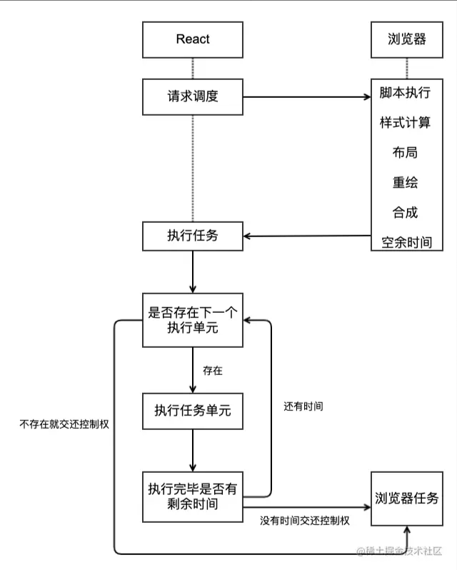
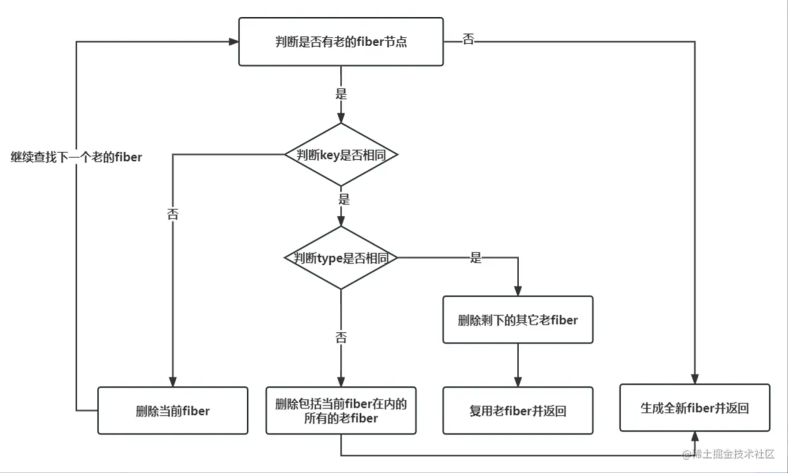

### react
* 无状态组件
    ```jsx harmony
    export default props => <div>Hello {props.name}</div>
    ```
    优点：
    1. 去除结构体和继承关系，纯函数更合理
    2. 代码更简洁，便于理解、测试。
    3. 后期的渲染性能更优 -- `react团队正在优化`
    4. 复用性更容易 -- 结合高阶组件，可以复用出不同的状态组件

* 高阶组件

* 路由写法

* 源码剖析
  * React fiber 原理
  
    1. Fiber 是 React 的一个执行单元，在 React 16 之后，React 将整个渲染任务拆分成了一个个的小任务进行处理，每一个小任务指的就是 Fiber 节点的构建。 拆分的小任务会在浏览器的空闲时间被执行
    2. Fiber 是一种数据结构，支撑 Fiber 构建任务的运转。当某一个 Fiber 任务执行完成后，怎样去找下一个要执行的 Fiber 任务呢？React 通过链表结构找到下一个要执行的任务单元
    3. Fiber 架构有两个阶段，render 阶段就是负责构架 Fiber 对象和链表，而 commit 阶段就是负责去构建 DOM


  * React 合成事件(SyntheticEvent)
    1. React 上注册的事件最终会绑定在document这个 DOM 上，而不是 React 组件对应的 DOM(减少内存开销就是因为所有的事件都绑定在 document 上，其他节点没有绑定事件)
    2. 更好的兼容性和跨平台, 方便事件统一管理（如事务机制）

  * React diff
  
    1. 比较两棵树的根节点，如果不同，则认为整棵树需要更新。
    2. 对于相同的节点，比较它们的属性和子节点。
    3. 对于同级节点，可以通过唯一 key 标识来判断是否为同一个节点，从而避免不必要的更新。
    4. 递归处理所有子节点。
        1. 对于有 key 的子节点，React 会尝试在旧的子节点中查找是否存在与之对应的节点。如果找到了，则将新节点复用旧节点，并对其进行更新；如果没有找到，则将新节点插入到相应位置。
        2. 对于新增的节点，直接插入到相应位置。
        3. 对于旧节点中已经不存在的节点，直接删除。
    5. 在比较过程中，React 会尽可能地复用已有的节点，以最小化 DOM 操作的次数。同时，React 还提供了一些优化手段，如 shouldComponentUpdate 和 React.memo，让开发者可以在需要时自定义组件更新的逻辑和条件。


### vue
* 路由写法 -- 按需加载 `需要简化`

    ```javascript
    import VueRouter from 'vue-router'
    const routes = [
        require('../routers/indexRouter').default,
    ]
    return new VueRouter(router)
    ```

    ```javascript
    exports.default = {
      path     : '/',
      component: resolve => require(['../pages/index.vue'], resolve)
    }
    ```

